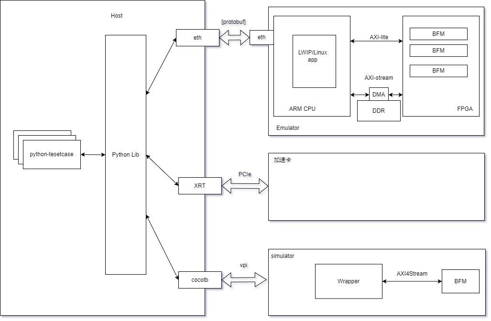

# Emulator for Acceleration

## Wrapper And BFM proto
---------
1. BFM中包含了AXI4Lite，AXI4Stream Slave（向模块发送数据），AXI4Stream Master（从模块中接收数据）三个接口，对应的信号都要根据AXI4协议给定

2. 使用Emulator时也可以不用Wrapper，因为Wrapper中完全没有具体逻辑，而且对用户也应该是不可见的

3. 上次统一的框图如下
